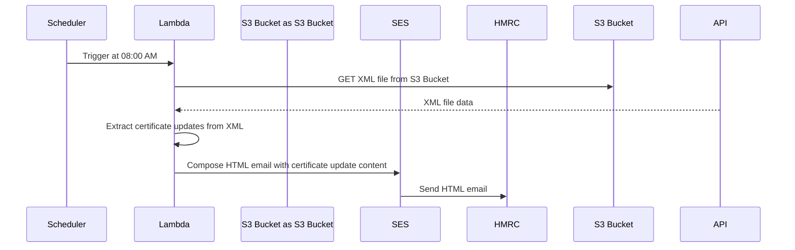

# trade-tariff-lambdas-xi-certificate-update-mailer

Scheduled go lambda function to notify HMRC CUPID team when certificates on the EU service have changed. This is anticipated to help with adjustments to the Appendix 5a content.

